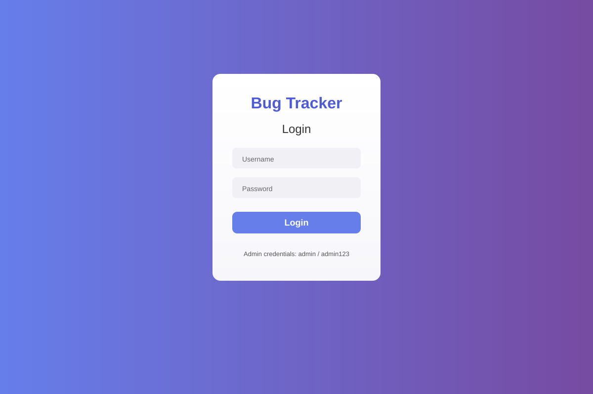
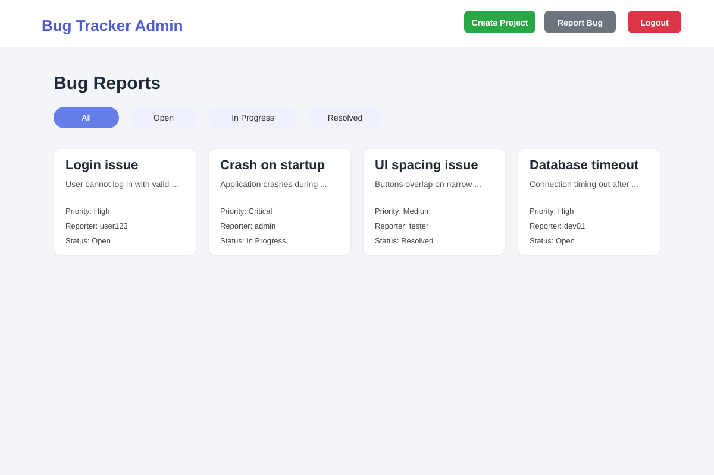
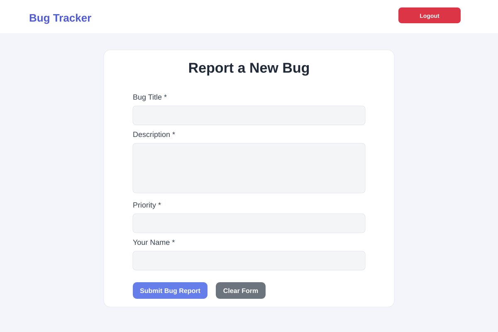
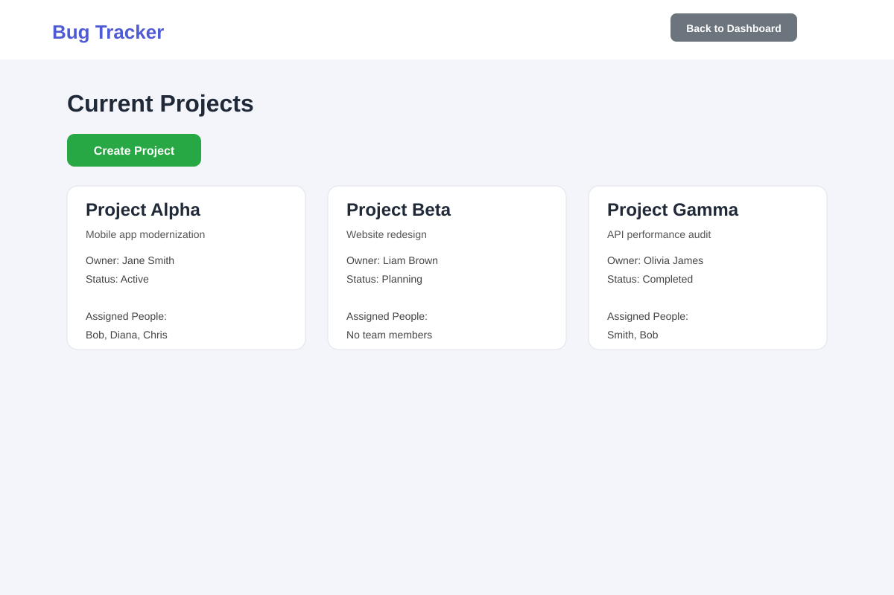

# Bug Tracker & Project Management System

A lightweight web application for managing bug reports, project tracking, and team assignment in a software development environment. This project was designed as a front-end prototype to demonstrate practical software engineering thinking, including usability, role-based access, state management, and workflow organization.

## Overview

This project allows:

- Admin users to manage bug reports and view project status
- Users to submit bug reports with severity and description
- Project creation and tracking across different stages
- Team assignment by linking people to active projects
- Local data persistence using browser storage for a realistic demo workflow

## Key Software Engineering Principles Demonstrated

- User-centered design: clear navigation and simple workflows for all roles
- Modularity: separate pages for login, reporting, administration, and project management
- Maintainability: structured UI logic and reusable styling patterns
- Role-based access control: different experiences for admin and standard users
- State management: use of localStorage to persist project, bug, and team data
- Scalability mindset: architecture is simple enough to extend into a full-stack application

## Features

- Login screen with admin and user validation
- Bug reporting form with priority selection and timestamps
- Admin dashboard with bug filtering by status
- Project creation and project status tracking
- Assignment of people to projects
- Responsive styling for a clean, professional interface

## Tech Stack

- HTML5
- CSS3
- JavaScript
- LocalStorage for client-side persistence

## Project Screenshots

### Login Page



### Admin Dashboard



### Bug Report Form



### Project Management View



## Project Structure

```text
WPR281/
├── index.html
├── admin.html
├── report-bug.html
├── Create-Project.html
├── addPeople.html
├── styles.css
├── Images/
│   └── Background Image.avif
├── screenshots/
│   ├── LoginPage.svg
│   ├── AdminDashboard.svg
│   ├── ReportBug.svg
│   └── ProjectManagement.svg
└── README.md
```

## How to Run

1. Download or clone the repository.
2. Open the project folder in a browser.
3. Open `index.html` to start the application.

## Future Enhancements

- Add a real backend with database storage
- Implement authentication with secure user management
- Add CRUD operations for bugs and projects
- Include search, sorting, and reporting features
- Convert the front-end to a modern framework such as React or Node.js

## Notes

This project is intended as a practical academic/front-end prototype that demonstrates software development fundamentals, design thinking, and workflow planning in a realistic software team context.

---

